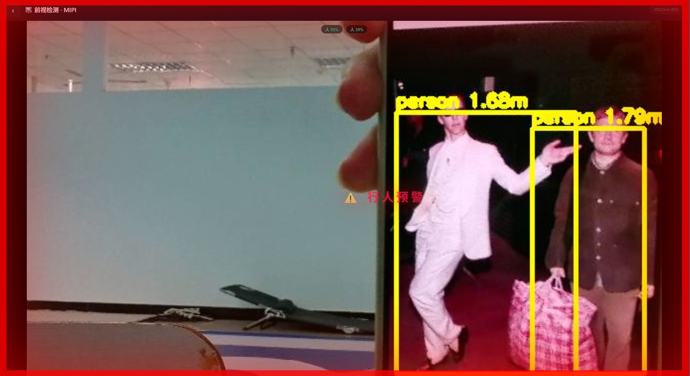
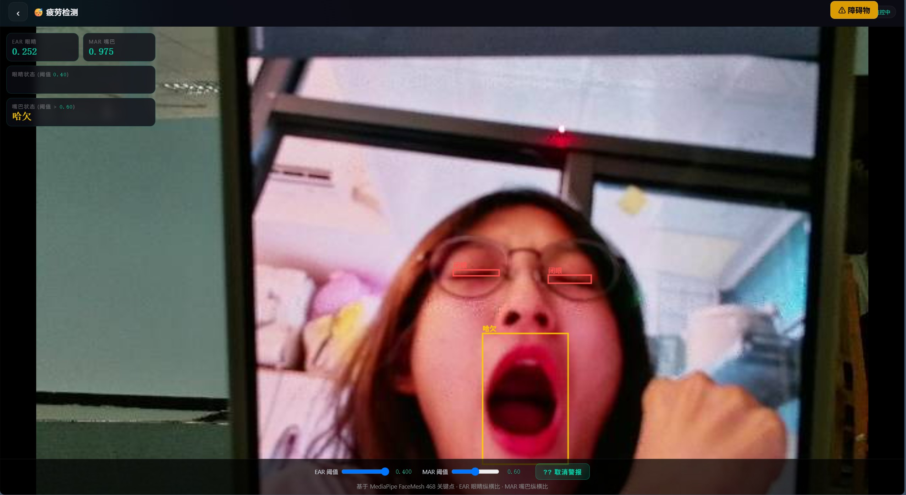
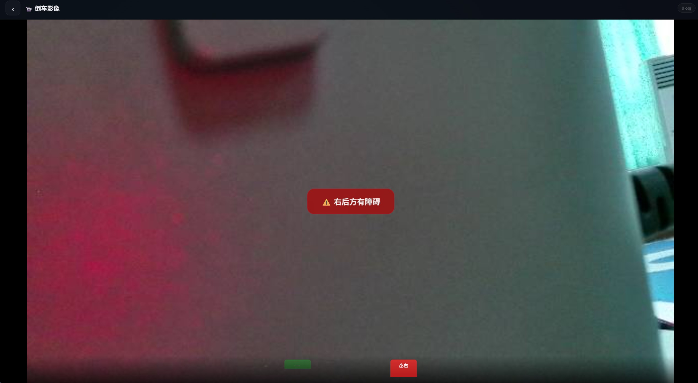
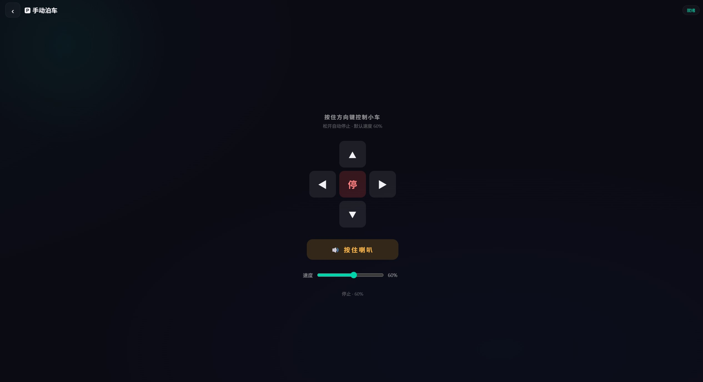
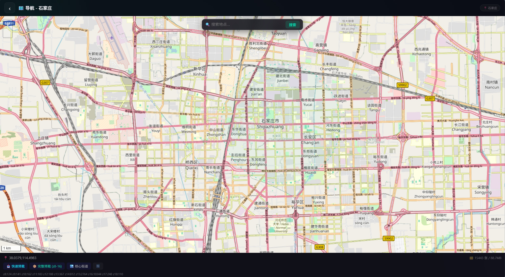
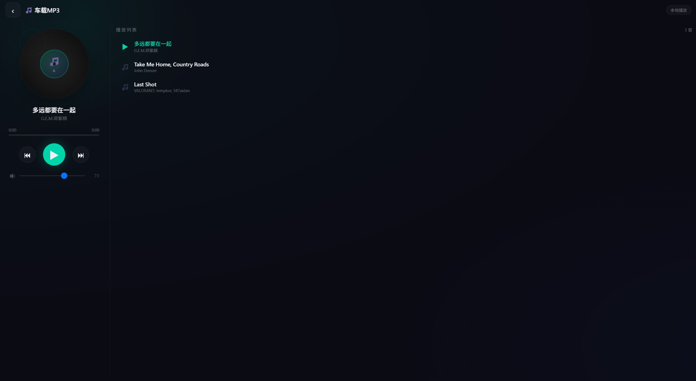
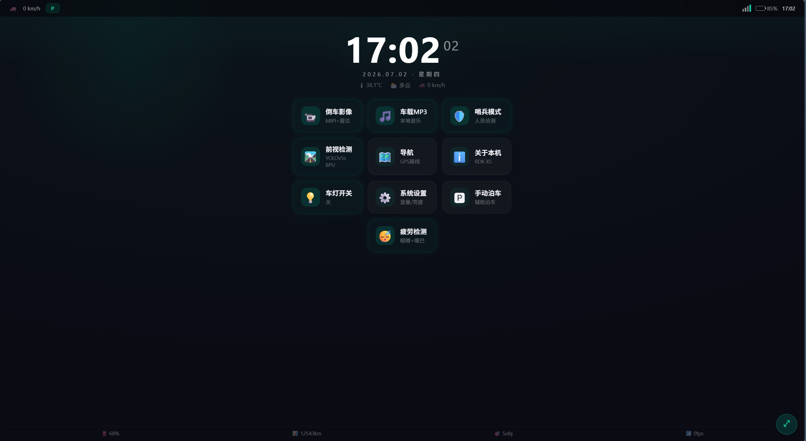

# RDK X5 车载 HMI 多模态感知与全域交互系统

[English Version](#english)

## 项目简介

本作品基于地平线 RDK X5 边缘计算平台（8×Cortex-A55 + 10 TOPS BPU），搭载 MIPI IMX219 摄像头（1920×1080 @30fps），打造了一套集 **环境感知、驾驶安全辅助、车载娱乐** 于一体的车机 HMI 系统。系统采用 Flask + 单页 HTML 架构，通过浏览器即可在任意终端（车机屏幕、手机、平板）访问完整交互界面。

## 核心功能

### �觉感知与 AI 推理
- **前视目标检测**：基于 YOLOv5s 模型，通过 BPU 硬件加速推理，实时识别行人、车辆、障碍物三类目标，并以彩色检测框叠加在视频流上

- **疲劳驾驶检测**：基于 MediaPipe FaceMesh 468 个面部关键点，实时计算 EAR（眼睛纵横比）和 MAR（嘴巴纵横比），通过状态机检测闭眼、哈欠等疲劳行为，支持 PERCLOS 滑窗评估和可调阈值

- **哨兵模式**：开启后持续检测画面中是否出现人员，触发声光报警，适用于停车安防场景

### 避障与倒车辅助
- **红外避障**：左后 / 右后双路红外传感器（LM393 模块），通过 GPIO 读取 active-low 信号，实时检测后方障碍
- **倒车影像**：MIPI 摄像头实时画面 + 红外避障联动，触发时前端显示方向警告横幅

### 车辆控制
- **手动泊车**：网页端 D-pad 虚拟摇杆，通过 PWM 驱动小车前进、后退、左转、右转、停止
- **车灯控制**：GPIO 驱动前/后 LED 车灯，支持一键开关切换
- **蜂鸣器/喇叭**：GPIO 驱动有源蜂鸣器，支持自动报警和手动按住鸣笛

### 车载应用
- **离线导航**：集成 Leaflet 地图，支持石家庄市区离线瓦片预载（多源下载 + 本地缓存），内置地点搜索（Photon 地理编码）
- **车载 MP3**：本地音乐播放器，黑胶唱片风格 UI，支持播放列表、上/下一曲、进度拖拽、音量调节
- **实时天气**：通过 Open-Meteo API 获取石家庄实时温度与天气状况，自动更新至主界面

### 系统设置
- **音量 / 亮度调节**：滑块实时控制系统音频输出（ALSA amixer）和屏幕背光亮度
- **系统信息**：显示平台型号、AI 模型规格、摄像头参数等

## 技术架构

```
┌─────────────────────────────────────────────────┐
│                  浏览器 (HMI)                    │
│   HTML + CSS + JavaScript                       │
│   Leaflet 地图 / Canvas 疲劳标注                  │
└────────────────────┬────────────────────────────┘
                     │ HTTP API (Flask)
┌────────────────────┴────────────────────────────┐
│              RDK X5 Python 服务                  │
│  ┌──────────┐ ┌──────────┐ ┌──────────────────┐ │
│  │ MIPI 采集 │ │ YOLOv5s  │ │ MediaPipe        │ │
│  │ srcampy   │ │ BPU 推理  │ │ FaceMesh 468点  │ │
│  └──────────┘ └──────────┘ └──────────────────┘ │
│  ┌──────────┐ ┌──────────┐ ┌──────────────────┐ │
│  │ GPIO 控制 │ │ 天气获取  │ │ 瓦片下载/缓存      │ │
│  │蜂鸣器/车灯│ │ Open-Meteo│ │ OSM Tiles        │ │
│  └──────────┘ └──────────┘ └──────────────────┘ │
└─────────────────────────────────────────────────┘
         │              │              │
    ┌────┴────┐    ┌────┴────┐    ┌────┴────┐
    │IMX219   │    │GPIO     │    │PWM Motor│
    │MIPI摄像头│    │传感器/LED│    │小车底盘  │
    └─────────┘    └─────────┘    └─────────┘
```

## 硬件外设

| 外设 | 接口 | 用途 |
|------|------|------|
| MIPI IMX219 摄像头 | MIPI CSI | 前视检测 / 倒车影像 / 疲劳检测 / 哨兵模式 |
| 红外避障模块 ×2 | GPIO 399/400 | 左后/右后障碍物检测 |
| 有源蜂鸣器 | GPIO 401 | 距离报警 / 疲劳报警 / 哨兵报警 |
| LED 车灯 | GPIO 402/387 | 前后车灯照明 |
| 小车底盘 | PWM (Hobot.GPIO) | 手动泊车控制 |

## 技术栈

- **AI 推理**：YOLOv5s (672×672 NV12) / BPU 10 TOPS / hbm_runtime + hobot_dnn
- **人脸检测**：MediaPipe FaceMesh (468 关键点)
- **后端**：Python 3 / Flask / Threading
- **地图**：OpenStreetMap 离线瓦片 / Photon 地理编码
- **天气**：Open-Meteo API (免密钥)
- **硬件控制**：Linux sysfs GPIO / ALSA amixer / Hobot.GPIO PWM

## 快速开始

```bash
# 在 RDK X5 上运行
python3 rdk-car-hmi-final-current.py

# 浏览器访问
http://<RDK_X5_IP>:8080
```

## 界面功能一览

| 功能 | 说明 |
|------|------|
| 倒车影像 | 实时 MIPI 画面 + 红外避障状态 + 检测标签 |
| 前视检测 | YOLOv5s 目标检测 + 行人距离预警 + 车辆/障碍物提示 |
| 车灯开关 | 一键控制 LED 车灯 |
| 车载 MP3 | 本地音乐播放 / 黑胶唱片 UI / 播放列表 |
| 导航 | Leaflet 离线地图 / 地点搜索 / 瓦片预载 |
| 系统设置 | 音量 / 亮度 / WiFi / 摄像头 / AI 模型信息 |
| 疲劳检测 | EAR/MAR 实时监控 / 闭眼哈欠检测 / 可调阈值 |
| 哨兵模式 | 人员侦测报警 / 蜂鸣器联动 |
| 手动泊车 | 虚拟摇杆 / 速度调节 / 按住鸣笛 |

---

<a id="english"></a>

# RDK X5 Vehicle HMI — Multimodal Perception & Full-Domain Interaction System

## Introduction

Built on the Horizon RDK X5 edge computing platform (8×Cortex-A55 + 10 TOPS BPU) with a MIPI IMX219 camera (1920×1080 @30fps), this project delivers an all-in-one vehicle HMI system that integrates **environmental perception, driving safety assistance, and in-vehicle entertainment**. Using a Flask + single-page HTML architecture, the full interactive interface is accessible from any device — car display, phone, or tablet — through a web browser.

## Core Features

### Visual Perception & AI Inference
- **Front-view Object Detection**: Powered by YOLOv5s with BPU hardware-accelerated inference, real-time detection of pedestrians, vehicles, and obstacles, with colored bounding boxes overlaid on the video stream
- **Driver Fatigue Detection**: Based on MediaPipe FaceMesh with 468 facial landmarks, real-time EAR (Eye Aspect Ratio) and MAR (Mouth Aspect Ratio) computation, state-machine-based detection of eye closure and yawning, with PERCLOS sliding window evaluation and adjustable thresholds
- **Sentinel Mode**: Continuously monitors the camera feed for human presence and triggers audio-visual alarms — ideal for parking security scenarios

### Obstacle Avoidance & Reversing Assistance
- **Infrared Obstacle Avoidance**: Dual rear infrared sensors (LM393 modules) on left/right sides, reading active-low GPIO signals for real-time rear obstacle detection
- **Reverse Camera**: Live MIPI camera feed integrated with infrared obstacle detection, displaying directional warning banners when triggered

### Vehicle Control
- **Manual Parking**: Web-based D-pad virtual joystick, driving the car forward, backward, turn left, turn right, and stop via PWM
- **Headlight Control**: GPIO-driven front/rear LED headlights with one-click toggle
- **Buzzer/Horn**: GPIO-driven active buzzer for automatic alerts and manual press-to-honk

### In-Vehicle Applications
- **Offline Navigation**: Integrated Leaflet map with offline tile preloading for Shijiazhuang city (multi-source download + local caching), built-in location search via Photon geocoding
- **In-Car MP3**: Local music player with vinyl record-style UI, playlist support, prev/next track, progress seeking, and volume control
- **Live Weather**: Fetches real-time temperature and weather conditions for Shijiazhuang via Open-Meteo API, auto-updating on the main screen

### System Settings
- **Volume / Brightness Control**: Slider-based real-time control of audio output (ALSA amixer) and screen backlight brightness
- **System Info**: Displays platform model, AI model specifications, camera parameters, etc.

## System Architecture

```
┌─────────────────────────────────────────────────┐
│              Browser (HMI Frontend)              │
│   HTML + CSS + JavaScript                       │
│   Leaflet Map / Canvas Fatigue Overlay          │
└────────────────────┬────────────────────────────┘
                     │ HTTP API (Flask)
┌────────────────────┴────────────────────────────┐
│            RDK X5 Python Service                 │
│  ┌──────────┐ ┌──────────┐ ┌──────────────────┐ │
│  │ MIPI Cap │ │ YOLOv5s  │ │ MediaPipe        │ │
│  │ srcampy   │ │ BPU Infer│ │ FaceMesh 468pts  │ │
│  └──────────┘ └──────────┘ └──────────────────┘ │
│  ┌──────────┐ ┌──────────┐ ┌──────────────────┐ │
│  │ GPIO Ctrl │ │ Weather  │ │ Tile Download    │ │
│  │Buzzer/LED │ │Open-Meteo│ │ OSM Tiles Cache  │ │
│  └──────────┘ └──────────┘ └──────────────────┘ │
└─────────────────────────────────────────────────┘
         │              │              │
    ┌────┴────┐    ┌────┴────┐    ┌────┴────┐
    │IMX219   │    │GPIO     │    │PWM Motor│
    │MIPI Cam │    │Sensor/LED│   │Car Chassis│
    └─────────┘    └─────────┘    └─────────┘
```

## Hardware Peripherals

| Peripheral | Interface | Purpose |
|------------|-----------|---------|
| MIPI IMX219 Camera | MIPI CSI | Front detection / Reverse camera / Fatigue monitoring / Sentinel mode |
| Infrared Obstacle Avoidance ×2 | GPIO 399/400 | Left/right rear obstacle detection |
| Active Buzzer | GPIO 401 | Distance alarm / Fatigue alarm / Sentinel alarm |
| LED Headlights | GPIO 402/387 | Front/rear vehicle lighting |
| Car Chassis | PWM (Hobot.GPIO) | Manual parking control |

## Tech Stack

- **AI Inference**: YOLOv5s (672×672 NV12) / BPU 10 TOPS / hbm_runtime + hobot_dnn
- **Face Detection**: MediaPipe FaceMesh (468 landmarks)
- **Backend**: Python 3 / Flask / Threading
- **Map**: OpenStreetMap offline tiles / Photon geocoding
- **Weather**: Open-Meteo API (no key required)
- **Hardware Control**: Linux sysfs GPIO / ALSA amixer / Hobot.GPIO PWM

## Quick Start

```bash
# Run on RDK X5
python3 rdk-car-hmi-final-current.py

# Access via browser
http://<RDK_X5_IP>:8080
```

## Feature Overview

| Feature | Description |
|---------|-------------|
| Reverse Camera | Live MIPI feed + infrared obstacle status + detection tags |
| Front Detection | YOLOv5s object detection + pedestrian distance alert + vehicle/obstacle warnings |
| Headlight Toggle | One-click LED headlight control |
| In-Car MP3 | Local music playback / vinyl record UI / playlist |
| Navigation | Leaflet offline map / location search / tile preloading |
| System Settings | Volume / brightness / WiFi / camera / AI model info |
| Fatigue Detection | EAR/MAR real-time monitoring / eye closure & yawn detection / adjustable thresholds |
| Sentinel Mode | Person detection alarm / buzzer integration |
| Manual Parking | Virtual joystick / speed control / press-to-honk |
